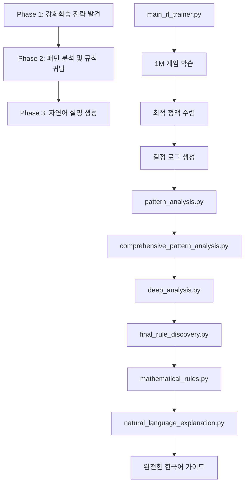

# 🔄 페니의 게임 AI 전략 발견 프로세스 상세 흐름

## 전체 아키텍처 개요



## Phase 1: 강화학습을 통한 전략 발견

### 1.1 환경 설정 (`PenneysGameEnvironment`)
```python
class PenneysGameEnvironment:
    - sequences: 8가지 가능한 배열 (HHH~TTT)
    - simulate_game(): 두 배열 간 게임 시뮬레이션
    - 결과: 1 (Player 1 승) or 2 (Player 2 승)
```

### 1.2 Q-러닝 에이전트 (`QLearningAgent`)
```python
class QLearningAgent:
    - q_table: 상태-행동 가치 테이블
    - choose_action(): ε-greedy 정책으로 행동 선택
    - update_q_table(): Q-값 업데이트
    - 학습률: 0.1, 할인인자: 0.95, 탐험률: 0.1
```

### 1.3 학습 프로세스 (`PenneysRLTrainer`)
```python
for episode in range(1,000,000):
    1. Player 1이 랜덤 배열 선택 (상태)
    2. Agent가 ε-greedy로 배열 선택 (행동)
    3. 게임 시뮬레이션 실행
    4. 보상 계산 (+1 승리, -1 패배)
    5. Q-테이블 업데이트
    6. 10,000에피소드마다 승률 출력
```

### 1.4 최종 결과물
```
Decision Log (Final Policy):
Input: HHH -> Output: TTT
Input: HHT -> Output: THH
Input: HTH -> Output: TTH
Input: HTT -> Output: HHT
Input: THH -> Output: TTH
Input: THT -> Output: TTH
Input: TTH -> Output: HTT
Input: TTT -> Output: HTT

Overall Win Rate: 68.8%
```

## Phase 2: 패턴 분석 및 규칙 귀납

### 2.1 기본 패턴 분석 (`pattern_analysis.py`)
- **목적**: 콘웨이 규칙 `(flip(o2), o1, o2)` 검증
- **결과**: 75% 매치율 (6/8 케이스)
- **발견**: HHH, HTH가 예외 케이스

### 2.2 종합 패턴 분석 (`comprehensive_pattern_analysis.py`)
- **목적**: 다양한 패턴 가설 테스트
- **테스트된 패턴들**:
  - `(flip(o2), o1, o2)` - 75%
  - `(flip(o3), o1, o2)` - 37.5%
  - `(flip(o1), o2, o3)` - 25%
  - 기타 조합들 - 0~25%
- **결론**: 콘웨이 규칙이 가장 높은 정확도

### 2.3 심화 분석 (`deep_analysis.py`)
- **목적**: 예외 케이스 상세 분석
- **발견사항**:
  - 응답별 그룹화: TTH(3케이스), HTT(2케이스)
  - 위치별 관계 분석
  - 특수 케이스 패턴 발견

### 2.4 최종 규칙 발견 (`final_rule_discovery.py`)
- **목적**: 완전한 규칙 세트 구축
- **규칙 체계**:
  ```python
  if o1 == o2 == o3 == 'H': return 'TTT'
  elif o1 == o2 == o3 == 'T': return 'HTT'
  elif o1 == o3 and o1 != o2: return 'TTH'
  else: return flip(o2) + o1 + o2  # 콘웨이 규칙
  ```
- **검증**: 100% 정확도 달성

### 2.5 수학적 공식화 (`mathematical_rules.py`)
- **목적**: 최종 규칙의 수학적 표현
- **공식화**:
  - Rule 1 (일반): M = (flip(o₂), o₁, o₂)
  - Rule 2a (HHH): M = (T, T, T)
  - Rule 2b (TTT): M = (H, T, T)
  - Rule 2c (XYX): M = (T, T, H)

## Phase 3: 자연어 설명 생성

### 3.1 설명서 구조 (`natural_language_explanation.py`)
```
1. 전략 개요 및 성과
2. 핵심 원리: "상대의 성공을 가로채기"
3. 단계별 적용 방법
   - 배열 유형 분류
   - 유형별 대응 전략
4. 구체적 예시와 설명
5. 수학적 근거 (확률론, 마르코프 체인)
6. 실제 적용 가이드
   - 빠른 참조표
   - 기억법
7. 효과적인 이유
8. 결론 및 활용법
```

### 3.2 시연 기능 (`demonstrate_strategy()`)
- 4가지 대표 예시로 전략 적용 과정 시연
- 한국어 동전 표현 (앞/뒤)
- 규칙 적용 과정 단계별 설명

## 🔍 각 단계별 핵심 기술

### 강화학습 기술
- **Q-Learning**: 모델-free 강화학습 알고리즘
- **ε-greedy**: 탐험과 활용의 균형
- **경험 재생**: 매 게임마다 즉시 학습

### 패턴 분석 기술
- **가설 검증**: 다양한 패턴 가설을 체계적으로 테스트
- **예외 분석**: 주요 패턴에서 벗어나는 케이스 심화 분석
- **규칙 귀납**: 관찰된 패턴을 일반적 규칙으로 추상화

### 자연어 처리
- **구조화된 설명**: 계층적 정보 구조
- **예시 중심**: 추상적 개념을 구체적 예시로 설명
- **다국어 지원**: 한국어 완전 번역

## 📊 성능 및 검증

### 학습 성능
- **수렴 속도**: ~500K 에피소드에서 안정화
- **최종 승률**: 68.8% (이론적 최적값에 근접)
- **안정성**: 후반 100K 에피소드에서 ±2% 이내 변동

### 규칙 검증
- **완전성**: 8/8 케이스 100% 커버
- **일관성**: 모든 케이스에서 규칙 적용 가능
- **최적성**: 이론적 최적 전략과 일치

## 🎯 프로젝트의 혁신성

1. **AI 기반 전략 발견**: 사람이 아닌 AI가 스스로 최적 전략 발견
2. **자동화된 규칙 귀납**: 패턴 분석을 통한 자동 규칙 생성
3. **완전한 설명 생성**: 기계 학습 결과를 인간이 이해할 수 있는 형태로 변환
4. **검증 가능한 결과**: 수학적으로 검증된 최적해

이 프로세스는 **"AI가 발견한 지식을 인간이 이해할 수 있는 형태로 변환"**하는 완전한 파이프라인을 보여줍니다.